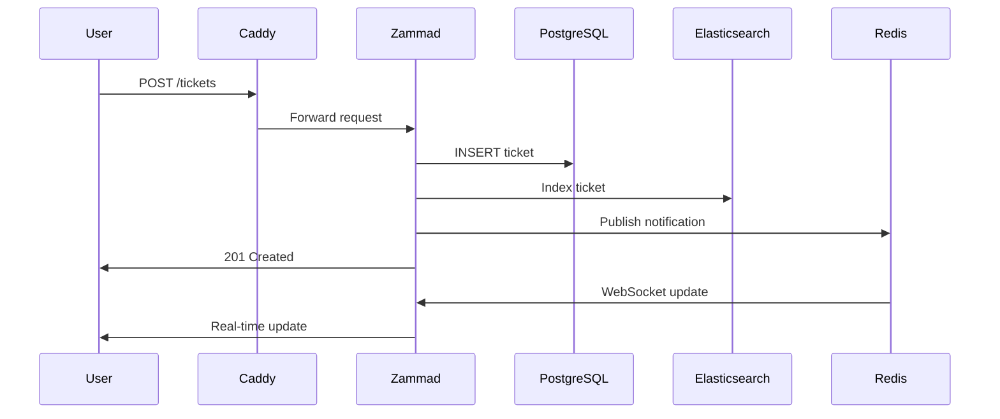
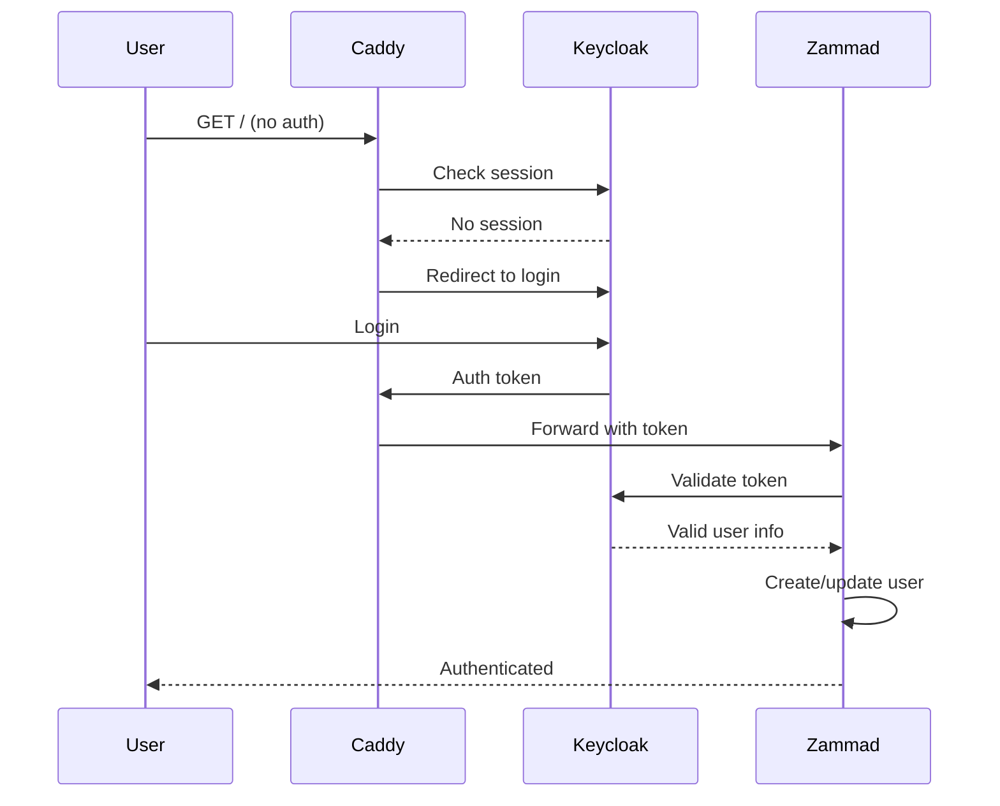

# Архитектура сервиса Support

## 1. Общее описание

Сервис технической поддержки на базе **Zammad 7.x** — open-source системы управления заявками (helpdesk/ITSM).

### Назначение

- Приём и обработка обращений пользователей
- Мультиканальность: email, веб-форма, телефония (опционально)
- База знаний для самообслуживания
- Отчётность и аналитика
- SLA-менеджмент

### Домены

| Домен | Назначение |
|-------|------------|
| `help.openedu.urfu.ru` | Основной домен |
| `help.urfu.online` | Обратная совместимость |

---

## 2. Архитектура системы

### 2.1. Компоненты системы

```
┌─────────────────────────────────────────────────────────────┐
│                    Platform Caddy Proxy                     │
│              (маршрутизация с help.openedu.urfu.ru)         │
│              (аутентификация через Keycloak)                │
└─────────────────────────────────────────────────────────────┘
                              │
                              ▼
┌─────────────────────────────────────────────────────────────┐
│                  Zammad Application Stack                   │
│                                                             │
│  ┌─────────────────┐  ┌─────────────────┐                 │
│  │  zammad-web     │  │ zammad-worker   │                 │
│  │  (port 80)      │  │ (background jobs)│                │
│  │  - Web UI       │  │ - Email processing│                │
│  │  - REST API     │  │ - Notifications  │                │
│  │  - WebSocket    │  │ - Reports        │                │
│  └─────────────────┘  └─────────────────┘                 │
└─────────────────────────────────────────────────────────────┘
         │                   │
         ▼                   ▼
┌─────────────┐     ┌─────────────┐     ┌─────────────────┐
│  PostgreSQL │     │    Redis    │     │  Elasticsearch  │
│   (данные)  │     │  (кэш/очереди)│   │    (поиск)      │
│  port 5432  │     │  port 6379  │     │   port 9200     │
└─────────────┘     └─────────────┘     └─────────────────┘
```

### 2.2. Технологический стек

| Компонент | Версия | Назначение |
|-----------|--------|------------|
| **Zammad** | 7.x | Helpdesk система |
| **PostgreSQL** | 15 | Основное хранилище данных |
| **Redis** | 7 | Кэш, очереди, real-time уведомления |
| **Elasticsearch** | 8.x | Полнотекстовый поиск, отчёты |
| **Memcached** | (опционально) | Дополнительный кэш сессий |

### 2.3. Внутренняя архитектура Zammad

```
┌─────────────────────────────────────────────────────────────┐
│                      Zammad Rails App                       │
│                                                             │
│  ┌──────────────┐  ┌──────────────┐  ┌──────────────────┐  │
│  │  Controllers │  │   Models     │  │    Views         │  │
│  │  (API + UI)  │  │  (ActiveRecord)│  │  (Vue.js)      │  │
│  └──────────────┘  └──────────────┘  └──────────────────┘  │
│                                                             │
│  ┌──────────────┐  ┌──────────────┐  ┌──────────────────┐  │
│  │  Jobs        │  │  Channels    │  │  ObjectManager   │  │
│  │  (Sidekiq)   │  │  (Email, etc)│  │  (Dynamic attrs) │  │
│  └──────────────┘  └──────────────┘  └──────────────────┘  │
└─────────────────────────────────────────────────────────────┘
                              │
                              ▼
┌─────────────────────────────────────────────────────────────┐
│                    Data Storage Layer                       │
│                                                             │
│  PostgreSQL:                    Elasticsearch:              │
│  - Users, Roles, Groups         - Full-text index           │
│  - Tickets, Articles            - Search queries            │
│  - Organizations                - Reporting aggregations    │
│  - Overviews, Triggers                                      │
│  - Dynamic objects (JSONB)                                  │
└─────────────────────────────────────────────────────────────┘
```

---

## 3. Модель данных

### 3.1. Основные сущности PostgreSQL

```sql
-- Упрощённая схема основных таблиц

users
├── id (uuid)
├── login (varchar)
├── email (varchar)
├── firstname (varchar)
├── lastname (varchar)
├── role_id (fk)
├── group_id (fk)
├── organization_id (fk)
└── active (boolean)

tickets
├── id (uuid)
├── title (varchar)
├── state_id (fk)
├── priority_id (fk)
├── customer_id (fk → users)
├── owner_id (fk → users)
├── group_id (fk)
├── organization_id (fk)
├── created_at (timestamp)
└── updated_at (timestamp)

ticket_articles
├── id (uuid)
├── ticket_id (fk → tickets)
├── user_id (fk → users)
├── subject (varchar)
├── body (text)
├── content_type (varchar)
├── internal (boolean)
└── created_at (timestamp)

organizations
├── id (uuid)
├── name (varchar)
├── domain (varchar)
└── active (boolean)

overviews
├── id (uuid)
├── name (varchar)
├── roles (jsonb)
├── conditions (jsonb)
└── order (jsonb)
```

### 3.2. Индексы Elasticsearch

```
zammad_tickets
├── id (keyword)
├── title (text + keyword)
├── body (text)
├── customer_email (keyword)
├── state (keyword)
├── priority (keyword)
├── group (keyword)
├── created_at (date)
└── tags (keyword)

zammad_users
├── id (keyword)
├── login (keyword)
├── email (keyword)
├── fullname (text)
└── organization (keyword)
```

---

## 4. Интеграции

### 4.1. Аутентификация (Keycloak)

```
┌──────────┐     ┌─────────────┐     ┌──────────┐
│  Client  │────▶│   Keycloak  │────▶│  Zammad  │
│ (Browser)│     │ (OAuth2/OIDC)│     │          │
└──────────┘     └─────────────┘     └──────────┘
                      │
                      ▼
              openedu.urfu.ru/auth
```

**Конфигурация:**
- Provider: OpenID Connect
- Realm: `urfu`
- Issuer: `https://openedu.urfu.ru/auth/realms/urfu`
- Client ID: `zammad-help`
- Redirect URI: `https://help.openedu.urfu.ru/auth/callback`

### 4.2. Email-каналы

```
┌──────────┐     ┌─────────────┐     ┌──────────┐
│  Email   │────▶│   Zammad    │────▶│  Ticket  │
│  (IMAP)  │     │  Email Box  │     │  Create  │
└──────────┘     └─────────────┘     └──────────┘
```

**Входящая почта:**
- Protocol: IMAP
- Server: `mail.openedu.urfu.ru:993` (SSL)
- Mailbox: `support@openedu.urfu.ru`

**Исходящая почта:**
- Protocol: SMTP
- Server: `smtp.openedu.urfu.ru:587` (STARTTLS)

### 4.3. Платформенные интеграции

| Интеграция | Компонент | Описание |
|------------|-----------|----------|
| **Caddy Proxy** | Platform | Маршрутизация, SSL, rate limiting |
| **Keycloak** | External | SSO аутентификация |
| **Restic Backup** | `_core/backup` | Ежедневные бэкапы |
| **Loki** | `_core/monitoring` | Централизованное логирование |
| **Prometheus** | `_core/monitoring` | Сбор метрик |

---

## 5. Конфигурация ресурсов

### 5.1. Лимиты контейнеров

| Сервис | CPU Limit | Memory Limit |
|--------|-----------|--------------|
| `zammad-web` | 1.0 | 2Gi |
| `zammad-worker` | 0.5 | 1Gi |
| `postgres` | 0.5 | 1Gi |
| `redis` | 0.25 | 512Mi |
| `elasticsearch` | 1.0 | 2Gi |

### 5.2. Elasticsearch Heap

```
# config/elasticsearch/jvm.options
-Xms2g
-Xmx2g
```

**Важно:** Heap size не должен превышать 50% доступной RAM и не более 32 ГБ (compressed oops).

---

## 6. Безопасность

### 6.1. Сетевая безопасность

- Все сервисы изолированы в `platform_network`
- Доступ извне только через Caddy (порт 80/443)
- Внутренние порты не опубликованы наружу

### 6.2. Аутентификация и авторизация

- SSO через Keycloak (OAuth2/OIDC)
- Ролевая модель Zammad:
  - **Admin**: полный доступ
  - **Agent**: обработка тикетов
  - **Customer**: создание тикетов

### 6.3. Защита данных

- HTTPS (TLS 1.3) для всего внешнего трафика
- Шифрование паролей (bcrypt)
- Шифрование сессионных данных
- Rate limiting через Caddy

---

## 7. Масштабируемость

### 7.1. Горизонтальное масштабирование

```yaml
# Возможность масштабирования
zammad-web:
  deploy:
    replicas: 2  # Можно увеличить при нагрузке

zammad-worker:
  deploy:
    replicas: 3  # Для обработки очереди
```

### 7.2. Вертикальное масштабирование

| Компонент | Min | Recommended | Max |
|-----------|-----|-------------|-----|
| RAM (всего) | 4 ГБ | 8 ГБ | 16 ГБ |
| CPU (всего) | 2 ядра | 4 ядра | 8 ядер |
| Диск (данные) | 20 ГБ | 50 ГБ | 200 ГБ |

---

## 8. Отказоустойчивость

### 8.1. Restart Policies

```yaml
restart: unless-stopped  # Для всех сервисов
```

### 8.2. Health Checks

```yaml
healthcheck:
  test: ["CMD", "curl", "-f", "http://localhost:80/health"]
  interval: 30s
  timeout: 10s
  retries: 3
  start_period: 60s
```

### 8.3. Бэкапы

- **Частота**: ежедневно в 02:00
- **Хранение**: 7 дней
- **Компоненты**: PostgreSQL, Elasticsearch, файлы Zammad
- **Инструмент**: Restic (через `_core/backup`)

---

## 9. Диаграммы

### 9.1. Последовательность создания тикета



### 9.2. Последовательность аутентификации


